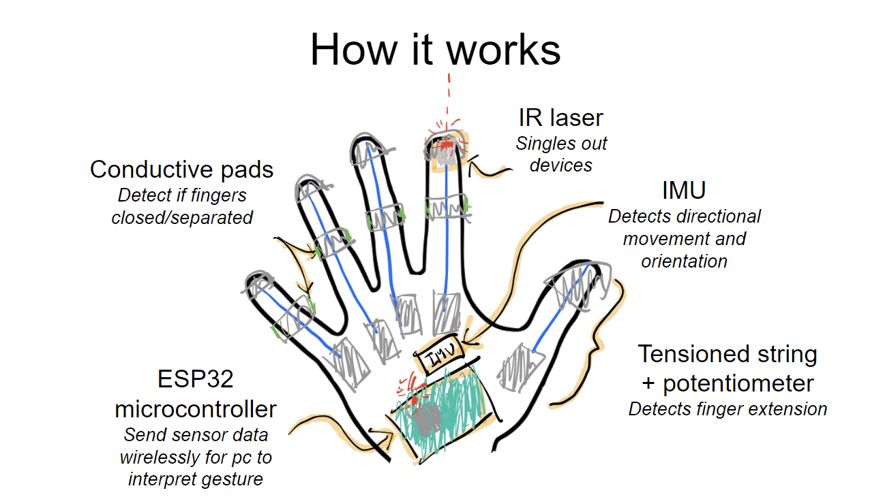
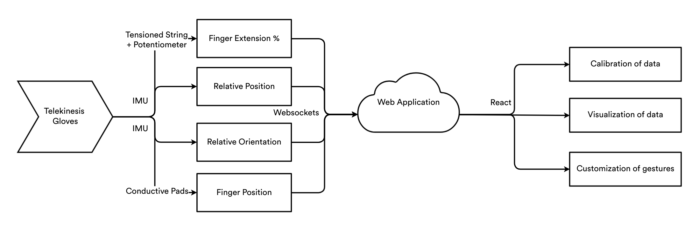
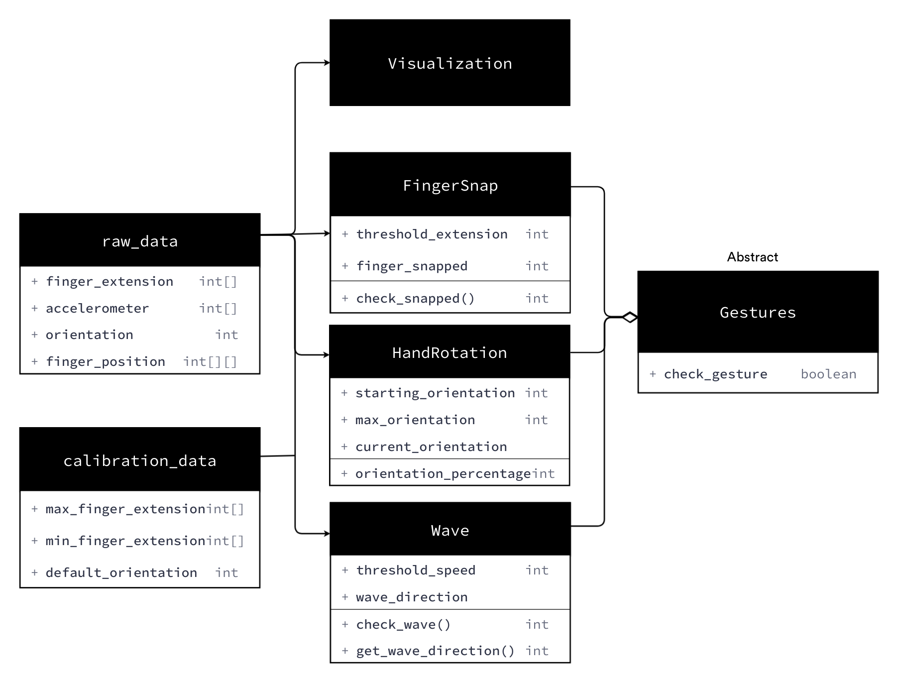

# Telekinesis Gloves

## Motivation

Inspired by the seamless futuristic technologies in science fiction, we thought one of the things that is lacking in current times are cool ways to interact with the technology around us.

While there are some technologies that can be controlled with simple hand movements, like waving, it has not reached the level seen in science fiction, where technology can be interacted with seamlessly using intricate hand gestures, as if casting a spell.

Our project aims to explore this concept and build a proof of concept of such an interface.

Video reference of a similar idea: [I made $22 Virtual Reality Gloves. - YouTube](https://www.youtube.com/watch?v=nmP8iGaPbeI)

## Project introduction

We wish to build a physical device that has:

- the ability to manipulate electronics/iot devices intuitively using a glove that detects hand gestures
- the ability to isolate desired devices to be controlled with gestures

## User stories

1. As a user, I want to be able to control IOT devices using simple gestures of my hand
2. As a user, I want to be able to specify which devices to respond to my hand gestures
3. As a user, I want to be able to set up the interface with relative ease.
4. As a user, I want to have a wide range of different commands that can be mapped to different gestures.
5. As a user, I want to be able to configure and have fine grained control over the specifications of hand gestures and what actions they map to
6. As a construction worker, I want to be able to control electronic devices without taking off my gloves.
7. As a handicapped personnel, I want to be able to have an alternative method of activating and controlling my electronics that may be of convenience to me.

&nbsp;

&nbsp;

## Features and timeline

### Features

Key features of hardware components:

- Be able to detect finger extension and contraction with potentiometer
- Be able to detect orientation via gyro data from the IMU
- Be able to detect movement of the hand using accelerometers from the IMU

Key features of software components:

- Be able to setup and calibrate the gloves (max/min finger extension values, etc.)
- Be able to identify certain actions using data collected (snapping of fingers, rotating of wrist, clenching of fist)
- Be able to visualize and adjust certain actions using fine grained controls
- Be able to map actions to different IOT devices

### Timeline

#### Prototype 0 (mid-june)

- prototype should be able to get finger data
  - similar in concept to: https://github.com/LucidVR/lucidgloves/wiki
- prototype should be able to get IMU data
- software should be able to collect data from the prototype
- software should be able to connect to different IOT devices and map simple movements (rotating wrist) to different commands

#### Prototype 1 (mid-july)

- prototype should be able to get data from infrared sensors
- software should be able to identify complex gestures (snapping of fingers, clenching of fist)
- software should be able to allow users to modify and control what commands get executed with different gestures

## Technologies/components to be used

The glove can be built with the following components:

- A microcontroller (ESP32/ Arduino Micro)
- IMU, Potentiometers, Rotary Springs, Mounts and variety of other sensors (to be experimented with)
- (Possibly) Infrared blasters, cameras, retroreflectors
- (Possibly) Conductive pads on each finger to detect if fingers are touching each other
- (Possibly) LEDs, small vibration motors for haptics

The software will be built with the following stack:

- React/Redux for the frontend
- Websocket to continuously poll and collect data from the glove
- (Possibly) some way to be able to visualize the data

Software Tech Stack:

- Git/GitHub for version control
- Jest for testing
- React/Redux for frontend framework
- Heroku for deployment

## Qualifications

| Name                | Ian Teng Yuan Kai                                                                                                                                                  | Lam Chun Yu                                                                                                                                                             |
| ------------------- | ------------------------------------------------------------------------------------------------------------------------------------------------------------------ | ----------------------------------------------------------------------------------------------------------------------------------------------------------------------- |
| Major               | Computer Engineering                                                                                                                                               | Computer Science                                                                                                                                                        |
| Relevant Experience | Internship at ASTAR Robotics and Autonomous Systems - Worked with ROS to control a mounted robotic arm, ESP32 boards to communicate with each other through ESPNOW | Internship at Fairmart as Frontend Software Engineer - Worked closely with React/Redux with JSX, familiarity with multiply libraries such as ElasticSearch, Material-UI |
| Tech Stack          | C, C++, NodeJS, Various Microcontrollers and sensors                                                                                                               | React/Redux, Typescript, JSX, Python, Git, NodeJS                                                                                                                       |
